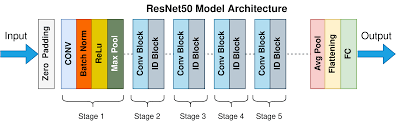
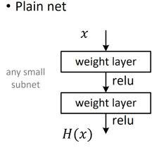
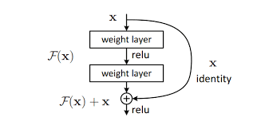
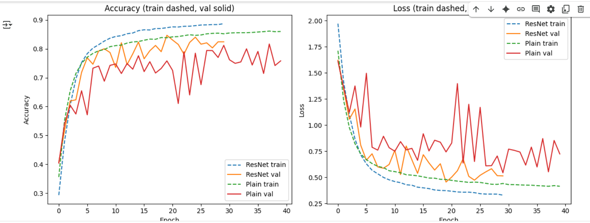
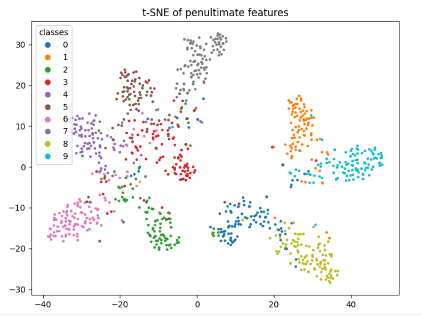
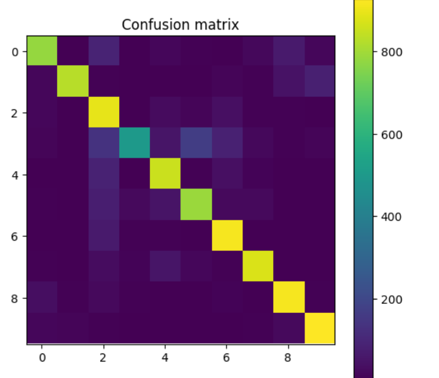

# ResNet vs Plain CNN on CIFAR-10: A Comparative Study  

## 📌 Project Overview  
This project compares **ResNet** and **Plain CNN** architectures on the **CIFAR-10 dataset**, highlighting the importance of **skip connections** in solving the degradation problem in deep learning.  

Our findings show that ResNet consistently outperforms Plain CNN, especially under **data-limited conditions**, proving the significance of residual learning in computer vision tasks.  

---

## 🚀 Key Features  
- Implementation of **Plain CNN** and **ResNet** architectures with equal parameter count (~4.3M).  
- Training and evaluation on **CIFAR-10 dataset**.  
- Use of **data augmentation** (random cropping, horizontal flipping, normalization).  
- Evaluation of:  
  - Training and validation accuracy/loss  
  - Final test accuracy  
  - Convergence speed  
  - Robustness with limited data (10%, 25%, 50%, 100%)  
- Visualization using **t-SNE** and **confusion matrices**.

---
## ResNet50 Arch
  

## PlainNet Work Flow
  
  
## RestNet Work Flow 
 


---

## 📂 Repository Structure  
├── ResNet vs Plain CNN on CIFAR-10_ A Comparative Study.pdf # Detailed project report
├── Computervisionintern.ipynb # Jupyter Notebook implementation
├── README.md # Project documentation


---

## ⚙️ Experimental Setup  
- **Dataset:** CIFAR-10 (60,000 images, 10 classes, 32x32 resolution)  
- **Training Config:**  
  - Batch size: 128  
  - Optimizer: SGD (lr=0.1, momentum=0.9, weight decay=5e-4)  
  - Epochs: 25 (with early stopping)  
- **Evaluation Metrics:** Accuracy, loss curves, convergence speed, data efficiency  

---

## 📊 Results  
- **ResNet Accuracy:** 83.8%  
- **Plain CNN Accuracy:** 72.5%  
- ResNet converged faster and showed more stable learning.
- 
- With **only 10% of training data**, ResNet maintained strong performance, while Plain CNN collapsed.  
- **t-SNE visualizations** showed clearer clustering with ResNet.
- 
- **Confusion matrices** revealed fewer misclassifications in similar classes.
-   

---

## 🔍 Key Insights  
- **Skip connections** solve the degradation problem in deeper networks.  
- ResNet is more **data-efficient**, making it suitable when labeled data is scarce.  
- ResNet outperforms Plain CNN in both **accuracy** and **generalization**.  

---

## 📖 How to Run  
1. Clone the repository:  
   ```bash
   git clone https://github.com/your-username/resnet-vs-cnn.git
   cd resnet-vs-cnn
